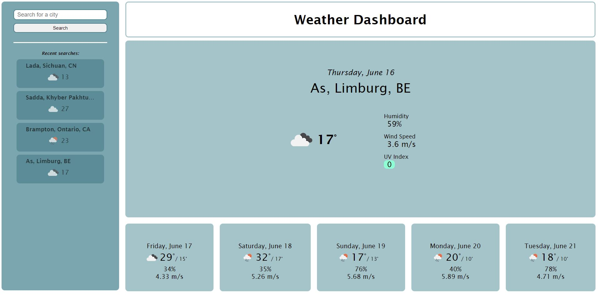

# weather-dashboard
A weather dashboard to show you the forecast of an inputed city.

You will be able to view the current weather as well as the forecast for the following 5 days.

The basic information will be provided:
* Temperature
* Humidity
* Wind
* UVI (with a visual indicator of low, moderate, and high)

The site will also note the 5 most recent searches.

## website
https://jcgcristel.github.io/weather-dashboard/

## contributions
Joyce C. Garnett